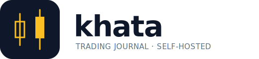

<div align="center">

<picture>
  <source media="(prefers-color-scheme: dark)" srcset="assets/logo-dark.svg">
  
</picture>

### Your trading journal. On your machine. Synced from your broker.

[](LICENSE)
[](pyproject.toml)
[](#status)

</div>

---

**khata** (खाता — Hindi for *ledger*) is an open-source trading journal for Indian markets. It syncs automatically from your broker, reconstructs round-trip trades from fills, and lets you attach screenshots, voice memos, and screen recordings to any trade.

Self-hosted. Your broker tokens never leave your machine. Zero telemetry.

## Why

Existing tools force a tradeoff you shouldn't have to make:

| Tool | Auto-sync from Indian brokers | Open source | Self-hosted | Journal + attachments |
|---|:-:|:-:|:-:|:-:|
| Zerodha Console | Zerodha only | ✗ | ✗ | Shallow |
| Tradezella / Tradervue | ✗ | ✗ | ✗ | ✓ |
| Spreadsheets | ✗ | — | ✓ | Manual |
| **khata** | ✓ | ✓ | ✓ | ✓ |

## Features

- **Auto-sync** from your broker — historical backfill and intraday polls.
- **Canonical trade schema** — one shape, every broker maps into it.
- **Round-trip reconstruction** (FIFO) across executions, including partial fills, scale-ins, scale-outs, and expiry settlements.
- **Attachments** — photos, voice memos, screen recordings, and PDFs on any trade or daily note.
- **Analytics** — calendar heatmap, equity curve, win rate / profit factor / expectancy, R-multiple distribution, strategy and psychology breakdowns.
- **Boring stack** — FastAPI + SQLite + HTMX. One Docker command to run. No cloud.

## Supported brokers

| Broker | Status |
|---|---|
| **Dhan** | ✅ v0.1 |
| Zerodha (Kite) | 🔜 next |
| Fyers | 🔜 |
| Upstox | 🔜 |
| Angel One | 🔜 |
| Groww, ICICI Direct, HDFC Sec | Contract-note import planned |

Want your broker added? See [`docs/ADAPTERS.md`](docs/ADAPTERS.md) — contracts are designed so each adapter is ~200 lines.

## Quick start

```bash
git clone https://github.com/khata-dev/khata
cd khata
cp .env.example .env
# edit .env: DHAN_CLIENT_ID and DHAN_ACCESS_TOKEN

uv sync
uv run khata init
uv run khata sync --broker dhan --since-days 30
uv run khata stats
```

Or with Docker:

```bash
docker compose up -d
docker compose exec khata khata sync --broker dhan
```

## Design principles

1. **Self-hosted, always.** Your data stays on your box. No telemetry.
2. **Broker adapters are pluggable.** The canonical schema is the only contract.
3. **Journaling is a behaviour, not a form.** Mobile capture takes under ten seconds.
4. **Boring stack.** FastAPI, SQLite, HTMX. Modify it in one afternoon.
5. **Apache 2.0, forever.** No open-core rug-pull.

## Status

Pre-alpha. The Dhan adapter, canonical schema, and round-trip engine are in. Web UI, attachments, and mobile capture (PWA) are the Weekend 2 and 3 scopes — see [`docs/ROADMAP.md`](docs/ROADMAP.md) once it lands.

## Contributing

See [`CONTRIBUTING.md`](CONTRIBUTING.md) for development setup and PR expectations. The fastest path to a useful contribution is writing an adapter for your broker: [`docs/ADAPTERS.md`](docs/ADAPTERS.md).

## Security

Broker tokens are sensitive. Keep them in `.env` (gitignored) or, for multi-user deployments, encrypted in the DB via `KHATA_SECRET`. Full details in [`docs/SECURITY.md`](docs/SECURITY.md).

## Licence

Apache 2.0. See [`LICENSE`](LICENSE).

---

<div align="center">
  <sub>Built for the Indian retail trader. One broker at a time.</sub>
</div>
